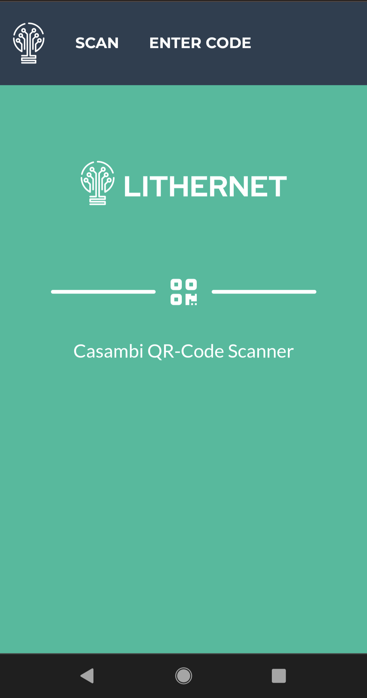
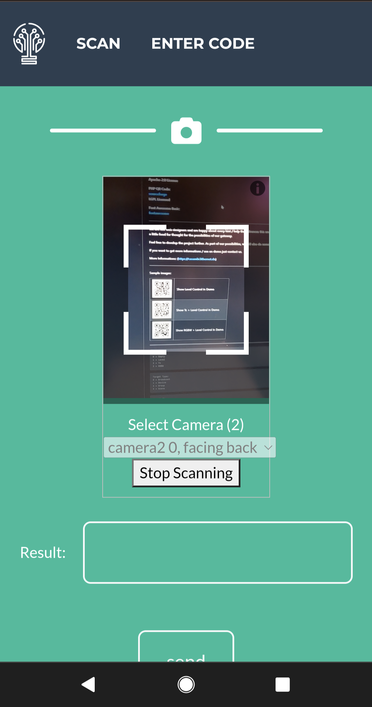
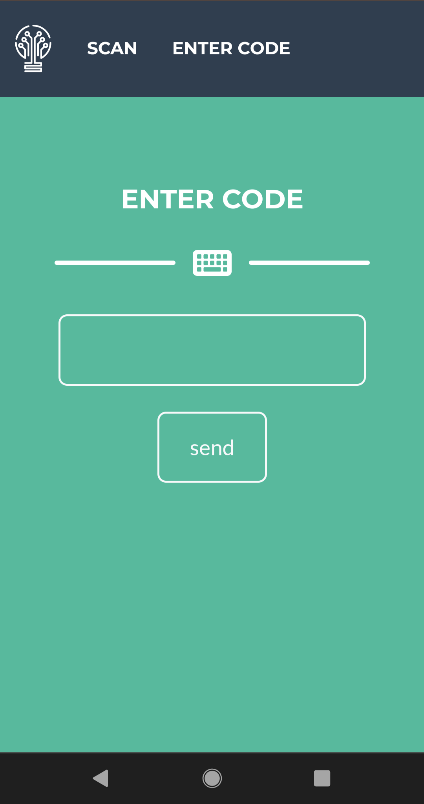
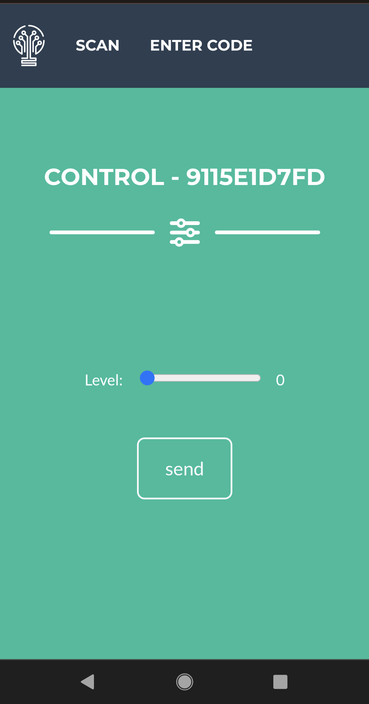
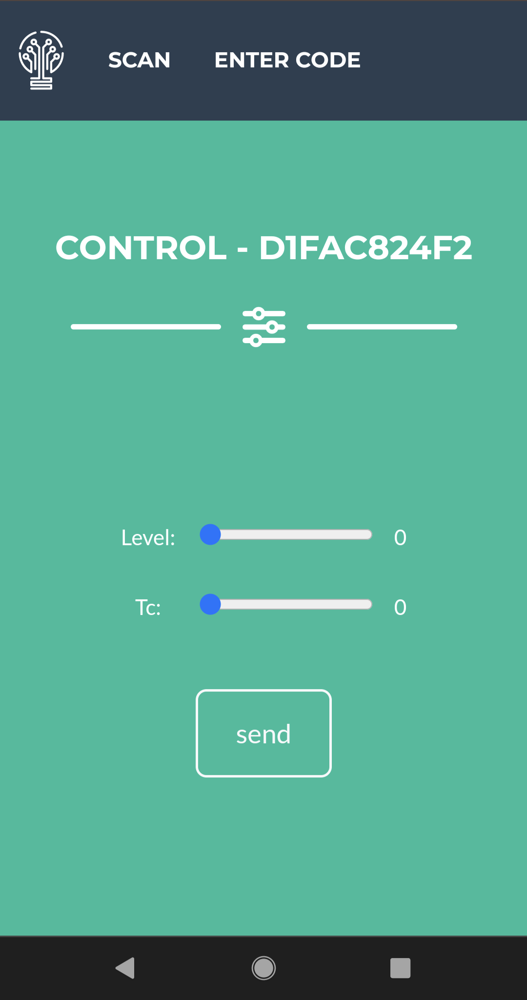
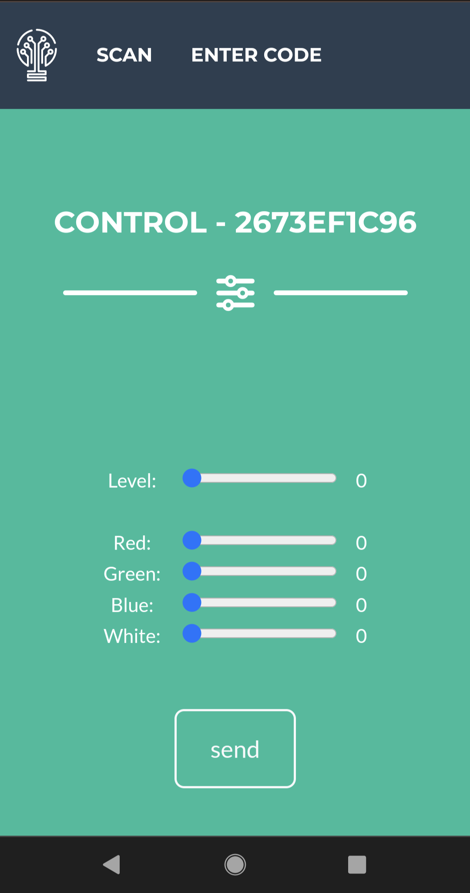
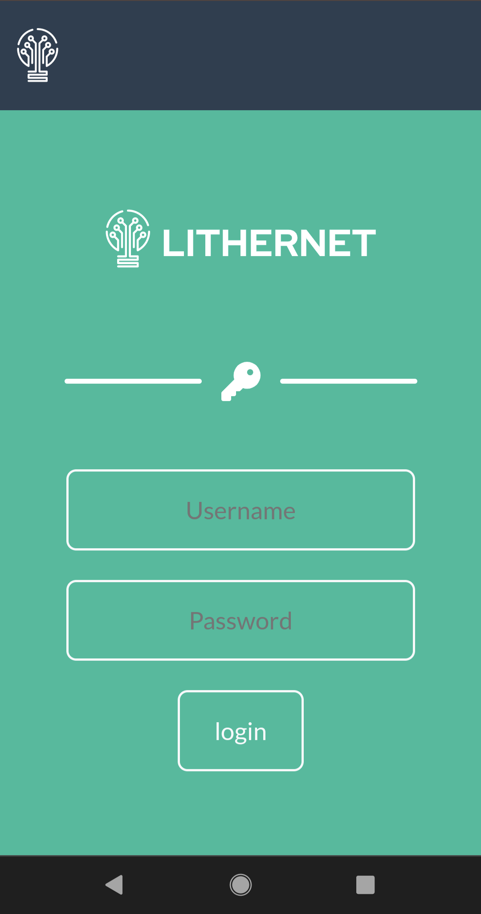
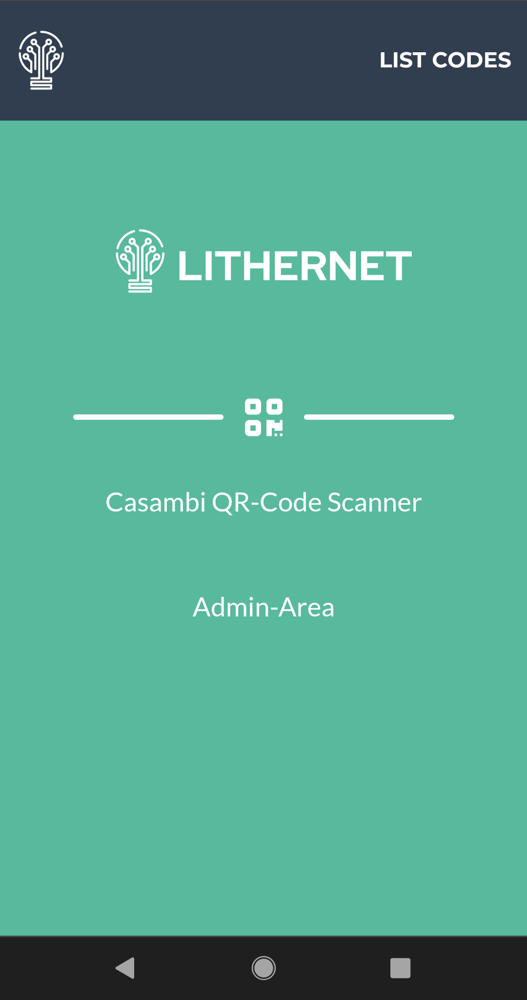
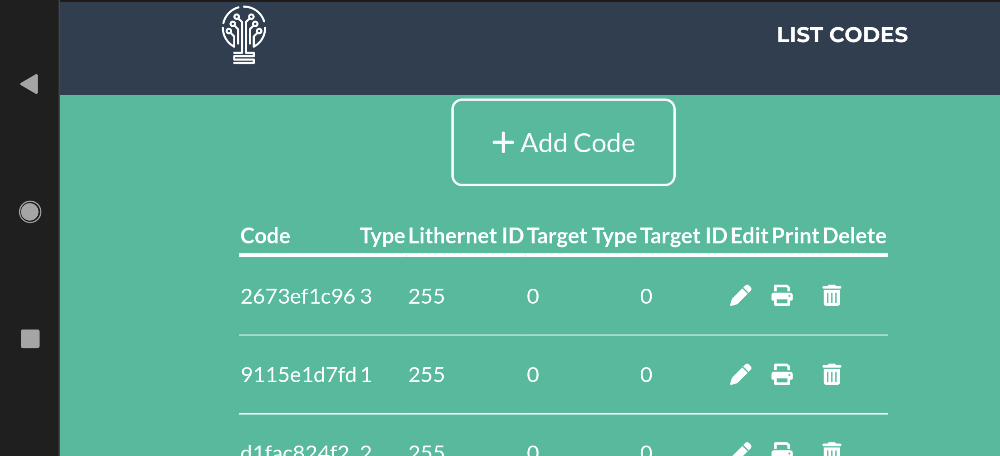
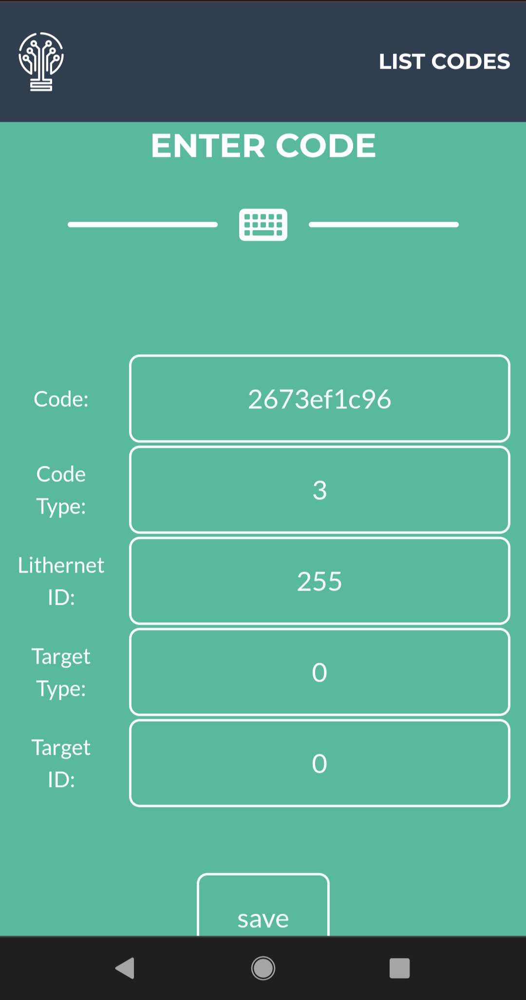

# Casambi_QRCode_PHP

Generate and manage QR codes that control a Casambi lighting network locally via the
[Lithernet Casambi Gateway](https://casambi.lithernet.de). Scan a code with the phone camera
(or type it in) and a control page appears with exactly the sliders and buttons the admin has
configured for that code: a name, an optional photo of the luminaire and any combination of
level, colour temperature, RGBW, hue/saturation, direct/indirect, scene and automation controls.

The web cam only works over **HTTPS** (browser requirement for camera access).

--------------------------------------------------------------------------------------

## Topics
1. [Requirements](#requirements)
2. [Installation](#installation)
3. [Upgrading](#upgrading)
4. [Project structure](#project-structure)
5. [User interface](#user-interface)
6. [Admin interface](#admin-interface)
7. [Control elements and protocol](#control-elements-and-protocol)
8. [Security notes](#security-notes)
9. [Third-party components](#third-party-components)
10. [About the project](#about-the-project)

--------------------------------------------------------------------------------------

## Requirements

- PHP 8.2 or newer with the extensions `mysqli`, `sockets`, `gd`, `mbstring`
- MySQL 8 / MariaDB 10.4 or newer
- Apache with `mod_rewrite` (or any web server whose document root can point at `public/`)
- [Composer](https://getcomposer.org/) for the QR image library
- HTTPS certificate (camera access)

## Installation

1. **Files**: clone or copy the repository to the server and run

   ```
   composer install --no-dev
   ```

2. **Web server**: point the document root at `public/`.
   If that is not possible (shared hosting), keep the repository root as document root: the
   included `.htaccess` routes every request into `public/` and the other directories deny
   direct access.

3. **Database user**: create a user with all rights on the (new or empty) database:

   ```sql
   CREATE USER 'lithernet'@'localhost' IDENTIFIED BY 'change-me';
   GRANT ALL PRIVILEGES ON lithernet.* TO 'lithernet'@'localhost';
   ```

   The setup wizard can create the database itself and the tables are created automatically
   on the first request. If you prefer a user with `SELECT, INSERT, UPDATE, DELETE` only,
   create the database and import `database/schema.sql` by hand once.

4. **Setup wizard**: make `config/` and `logs/` writable by the web server, then open the site
   in the browser. Without a configuration every page redirects to `setup.php`, which

   - checks PHP version, extensions, writable directories, Composer packages and HTTPS,
   - asks for the database connection (with "test connection" and "create database if
     missing"), the gateway broadcast address and port and the operation mode
     (`demo` = store values only, `run` = send UDP commands to the gateway),
   - writes `config/config.php` and continues to the admin area, where the tables are created
     and the first admin account is set up.

   `config/config.php` is ignored by git; all further options are documented in
   `config/config.example.php`. To protect the wizard on a publicly reachable server, put a
   secret into `config/setup.key` before opening the page; the wizard then asks for it.

   Without browser access run the same setup on the shell (database, gateway, admin account):

   ```
   php bin/setup.php
   ```

   For photo uploads `upload_max_filesize` and `post_max_size` in `php.ini` must be at least
   the configured `image_max_upload_bytes` (default 8 MB).

5. **Admin account**: created by the wizard. To add or reset one later:

   ```
   php bin/create-admin.php <username>
   ```

## Upgrading

Back up the database first (`mysqldump -u root -p lithernet > backup.sql`), replace the files,
run `composer install --no-dev` and create `config/config.php` from the template.

**The schema is upgraded automatically.** On the next request the application detects the
version of the database (a `schema_migrations` table, or the table structure for databases
created before that table existed) and applies the missing steps in order. The steps are
written to the error log and shown once in the admin area. This needs `CREATE, ALTER, DROP,
INDEX, REFERENCES` rights for the database user; without them a plain text page explains
what to do and nothing is changed. In that case run the scripts by hand:

| Coming from | Run in this order |
|---|---|
| 2022 version (`mysql/lithernet.sql`, plain-text passwords) | `migrate-v1-to-v2.sql`, `migrate-v2-to-v3.sql`, `migrate-v3-to-v4.sql` |
| v2 (one fixed code type per code) | `migrate-v2-to-v3.sql`, `migrate-v3-to-v4.sql` |
| v3 (control elements, no settings / languages tables) | `migrate-v3-to-v4.sql` |

What the migrations do:

- **v1 to v2**: password column for hashes, login throttling columns, value ranges, foreign
  keys. Existing plain-text passwords are converted to a bcrypt hash automatically at the first
  successful login. Passwords used to be cut to 10 lowercase letters/digits; after the first
  login the full password you typed is what counts.
- **v2 to v3**: every code gets a name (initially the code itself) and its fixed type is turned
  into control elements: Level becomes a level slider, Tc a level plus colour temperature slider
  (the old 0-254 values were not Kelvin, they are reset to 4000 K), RGBW a level plus RGBW slider
  group, Scene a scene slider. Old codes of type None get no elements.
- **v3 to v4**: adds the `settings`, `languages` and `translations` tables for the admin tabs
  Settings and Languages. Existing data is not touched.

Printed QR codes keep working across all versions: the codes themselves are unchanged.

## Project structure

```
public/                 document root
  index.php             start page, scanner, code entry, control page
  control.php           JSON endpoint: store element values and send the gateway command
  image.php             streams the photo of a code
  admin.php             admin area (first admin, login, codes, elements, photo)
  qr.php                streams the QR PNG for a code (admin only)
  setup.php             first-run wizard, only while config/config.php is missing
  assets/css|js|fonts|img
src/
  bootstrap.php         config, error handling, session, security headers, schema check
  helpers.php           escaping, input cleaning, CSRF, flash messages, render()
  db.php                mysqli connection + prepared-statement helpers
  auth.php              password hashing, login throttling, logout
  casambi.php           target types, element type registry, command strings, UDP sending
  qrcodes.php           repository for codes, elements and images
  migrations.php        automatic schema installation and upgrades
  settings.php          runtime settings stored in the database (admin tab "Settings")
  i18n.php              languages, t() translation function, string catalogue
  setup.php             requirement checks, connection test, writing config.php
  icons.php             inline SVG icons (Bootstrap Icons)
  templates/            HTML templates (layout, index/, admin/, setup/)
config/                 config.example.php (template), config.php (local, ignored), setup.key (optional)
database/               schema.sql, migrate-v1-to-v2.sql, migrate-v2-to-v3.sql, migrate-v3-to-v4.sql
bin/setup.php           CLI: first-run setup (config, schema, admin account)
bin/create-admin.php    CLI: create admin / reset password
docs/images/            screenshots used below
logs/                   PHP error log (ignored)
vendor/                 Composer packages (ignored)
```

--------------------------------------------------------------------------------------

## User interface

<table>
<tr>
<th>Screenshot 1</th>
<th>Screenshot 2</th>
<th>Description</th>
</tr>
<tr>
<td>&nbsp;</td>
<td></td>
<td>start screen</td>
</tr>
<tr>
<td></td>
<td></td>
<td>scan the code, or enter the number by hand</td>
</tr>
<tr>
<td>&nbsp;</td>
<td></td>
<td>control level</td>
</tr>
<tr>
<td>&nbsp;</td>
<td></td>
<td>control tc + level</td>
</tr>
<tr>
<td>&nbsp;</td>
<td></td>
<td>control rgbw + level</td>
</tr>
</table>

The screenshots show the 2022 layout. Today the control page shows the code's name, its photo
(if one was uploaded) and the configured elements in the configured order. Slider changes are
sent when the slider is released, buttons send immediately. Every element stores only its own
values, so changing the colour temperature never resets the stored level.

## Admin interface

<table>
<tr>
<th>Screenshot 1</th>
<th>Screenshot 2</th>
<th>Description</th>
</tr>
<tr>
<td>&nbsp;</td>
<td></td>
<td>login screen</td>
</tr>
<tr>
<td>&nbsp;</td>
<td></td>
<td>start screen after login</td>
</tr>
<tr>
<td>&nbsp;</td>
<td></td>
<td>show all created codes</td>
</tr>
<tr>
<td>&nbsp;</td>
<td></td>
<td>edit settings of a code</td>
</tr>
</table>

Workflow: **Add Code** creates a new random code and opens its edit page. There you set

- **Name** (heading of the control page) and **Lithernet ID** (255 = all gateways),
- an optional **photo** (JPEG, PNG, GIF or WebP; downscaled to `image_max_px`, stored as JPEG in
  the database, re-encoded so no metadata survives),
- the list of **control elements**: choose a type in "Add element", press save, then give the
  element a name, order number, target type / target id, fade time and, depending on the type,
  a Kelvin range or a fixed level. Tick "Delete" and save to remove an element.

**Preview** opens the public control page, **QR code** shows and downloads the PNG for printing.

The admin area has three tabs:

- **Codes**: the QR codes and their control elements as described above.
- **Settings**: gateway broadcast address, UDP port and operation mode, default language, admin
  session timeout, login lockout, photo limits. Values saved here are stored in the database
  and override `config/config.php`; a badge next to each field shows where the current value
  comes from, and "reset to config.php" removes all stored overrides. The database access itself
  stays in `config/config.php`.
- **Languages**: English is built in and the source of every fixed text. Add a language
  (browser code such as `de`, `fr`, `pt-br` plus a display name), open its translation editor
  and fill in the strings; the list of strings is read from the source code, so it is always
  complete, and empty entries fall back to English. Enable the language when ready. Visitors get
  a language by explicit choice (the EN / DE switcher in the navigation, remembered in the
  session), then browser preference, then the default language from the settings. Translations
  cover the public pages, the admin area and the status messages of the control page.

--------------------------------------------------------------------------------------

## Control elements and protocol

| Element type | Shown as | Sends |
|---|---|---|
| Level slider | 1 slider 0-254 | SetLevel (32) |
| On / Off buttons | 2 buttons | SetLevel (32) with 254 / 0 |
| Colour temperature slider | 1 slider, min-max Kelvin | SetTargetColorTemperature (72) |
| RGBW sliders | 4 sliders 0-254 | SetTargetColorRGBW (47) |
| Hue / saturation sliders | hue 0-359, saturation, white | SetTargetColorHueSat (61) |
| Direct / indirect slider | 1 slider 0-254 | SetTargetVertical (49) |
| Scene level slider | 1 slider 0-254 | SetSceneLevel (30), scene number = target id |
| Scene button | 1 button, fixed level | SetSceneLevel (30) |
| Resume automation button | 1 button | ResumeAutomation (74) |

```
Target Type (per element):
0 = Broadcast          4 = Scene All
1 = Device             5 = Vendor ID
2 = Group              8 = Multicast (Unit Set index as target id)
3 = Scene Active
```
```
Target ID:
Broadcast => 0
Device    => 1-250
Group     => 0 = ungrouped, 1-255 = group
Scene     => 1-255 = scene number (scene slider / scene button)
Multicast => 0-15 = unit set index defined in the gateway
```

Commands are sent as UDP broadcast to `lithernet.broadcast_ip:port` (default
`192.168.1.255:10009`) in the gateway's int format `<gateway id>#114#<length>#<opcode>#…`.
16-bit values (fade time in ms, Kelvin, hue) are sent as explicit low/high bytes:

```
level / on-off : <gw>#114#6#32#<level>#<fadeLo>#<fadeHi>#<target_type>#<target_id>
tc             : <gw>#114#7#72#<kelvinLo>#<kelvinHi>#<fadeLo>#<fadeHi>#<target_type>#<target_id>
rgbw           : <gw>#114#8#47#<red>#<green>#<blue>#<white>#<target_type>#<target_id>#255
hue/sat        : <gw>#114#8#61#<hueLo>#<hueHi>#<sat>#<white>#<target_type>#<target_id>#255
vertical       : <gw>#114#6#49#<ratio>#<fadeLo>#<fadeHi>#<target_type>#<target_id>
scene          : <gw>#114#5#30#<scene>#<level>#<fadeLo>#<fadeHi>
resume         : <gw>#114#3#74#<target_type>#<target_id>
```

The trailing 255 of the colour commands keeps the current brightness; add a level slider
element to control it.

## Security notes

- Admin passwords are stored with `password_hash()`; after 5 failed logins (configurable) the
  account is locked for 15 minutes.
- Every state-changing request is a POST with a CSRF token; the session cookie is
  `HttpOnly`, `SameSite=Strict` and `Secure` on HTTPS. Admin sessions expire after 30 minutes
  of inactivity.
- All SQL uses prepared statements; all output is escaped. Uploaded photos are validated,
  decoded and re-encoded with GD before they are stored.
- A Content-Security-Policy, `X-Frame-Options`, `Referrer-Policy` and
  `Permissions-Policy` are sent by `src/bootstrap.php`.
- QR codes are 40-bit random values (`random_bytes`). They are the only protection of the
  public control page, so treat printed codes like keys and run the app inside the local
  network or behind HTTPS.
- Errors are logged to `logs/php-error.log` and never displayed to visitors.

## Third-party components

| Component | Version | License | Used for |
|-----------|---------|---------|----------|
| [Bootstrap](https://getbootstrap.com/) via [Start Bootstrap Freelancer](https://startbootstrap.com/theme/freelancer) | 5.1.3 / 7.0.6 | MIT | layout (`public/assets/css/style.css`) |
| [Bootstrap Icons](https://icons.getbootstrap.com/) | 1.13.1 | MIT | inline SVG icons (`src/icons.php`) |
| [barcode-detector](https://github.com/Sec-ant/barcode-detector) | 3.2.2 | MIT | QR scanning in the browser |
| [zxing-wasm](https://github.com/Sec-ant/zxing-wasm) | 3.1.3 | MIT | WebAssembly decoder used by barcode-detector, served from `public/assets/js/vendor/` |
| [chillerlan/php-qrcode](https://github.com/chillerlan/php-qrcode) | ^6.0 | MIT | QR image generation (Composer) |
| [Montserrat](https://fonts.google.com/specimen/Montserrat), [Lato](https://fonts.google.com/specimen/Lato) | v23 / v22 | SIL OFL 1.1 | self-hosted fonts |

Replaced since the 2022 version: `phpqrcode` (LGPL, unmaintained since 2010), `html5-qrcode`
(Apache-2.0, no releases since 2023) and Font Awesome (CC BY 4.0 icons).

## About the project

We are not web designers and are happy about every hint / help that advances this small
project. Our goal is to give a little food for thought for the possibilities of our gateway.

Feel free to develop the project further. As part of our possibilities, we will also do some
fine-tuning. If you want more information or a demo, just contact us:
[casambi.lithernet.de](https://casambi.lithernet.de)

License: MIT (see `LICENSE`).
