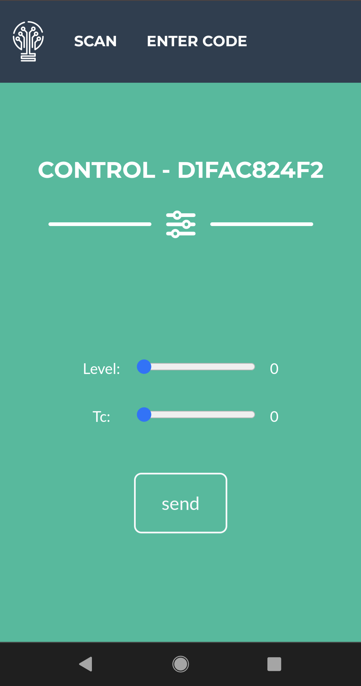

# Casambi_QRCode_PHP

With this tool you can generate and manage QR codes to control a Casambi-based light control locally in the network via the Lithernet Casambi Gateway.

Requires an SSL connection for the webcam under Chrome.

--------------------------------------------------------------------------------------

Used Components:

Freelancer:<br/>
[startbootstrap](http://startbootstrap.com)<br/>
MIT license

Html5-QRCode:<br/>
[GitHub](https://github.com/mebjas/html5-qrcode)<br/>
Apache-2.0 License

PHP QR Code:<br/>
[sourceforge](http://phpqrcode.sourceforge.net/)<br/>
LGPL Licensed

Font Awesome Basic:<br/>
[fontawesome](https://fontawesome.com/)<br/>

--------------------------------------------------------------------------------------

We are not web designers and are happy about every hint / help that advances this small project.
Our goal is to give a little food for thought for the possibilities of our gateway.

Feel free to develop the project further. As part of our possibilities, we will also do some fine-tuning.

If you want to get more informations / see an demo just contact us. 

More Informations: (https://casambi.lithernet.de)

--------------------------------------------------------------------------------------

User Interface:

<table>
<tr>
<th>Screenshot 1</th>
<th>Screenshot 2</td>
<th>Description</th>
</tr>
<tr>
<tr>
<td>&nbsp;</td>
<td></td>
<td>startscreen</td>
</tr>
<tr>
<td></td>
<td></td>
<td>scan the code, or enter the number by hand</td>
</tr>
<tr>
<td>&nbsp;</td>
<td></td>
<td>control level</td>
</tr>
<tr>
<td>&nbsp;</td>
<td></td>
<td>control tc + level</td>
</tr>
<tr>
<td>&nbsp;</td>
<td></td>
<td>control rgbw + level</td>
</tr>
</table>

--------------------------------------------------------------------------------------

Admin Interface:

<table>
<tr>
<th>Screenshot 1</th>
<th>Screenshot 2</td>
<th>Description</th>
</tr>
<tr>
<td>&nbsp;</td>
<td></td>
<td>login screen</td>
</tr>
<tr>
<td>&nbsp;</td>
<td></td>
<td>startscreen after login</td>
</tr>
<tr>
<td>&nbsp;</td>
<td></td>
<td>show all created codes</td>
</tr>
<tr>
<td>&nbsp;</td>
<td></td>
<td>edit settings from an code</td>
</tr>
</table>

--------------------------------------------------------------------------------------

Sample QR Code images:

<table>
<tr>
<td></td>
<td>Show Level Control in Demo</td>
</tr>
<tr>
<td></td>
<td>Show Tc + Level Control in Demo</td>
</tr>
<tr>
<td></td>
<td>Show RGBW + Level Control in Demo</td>
</tr>
</table>

--------------------------------------------------------------------------------------

```
Code Type:
0 = Empty
1 = Level
2 = Tc
3 = RGBW
```
```
Target Type:
0 = Broadcast
1 = Device
2 = Group
4 = Scene
```
```
Target ID:
Broadcast => 0
Device => 1-250
Group => 0 = ungrouped, 1-255 = Group
Scene => 1-255 = Group
```

```
config/config.php

$operation_mode = "demo"; //demo = no UDP Commands send
$operation_mode = "run"; //run = UDP Commands send to gateway
```